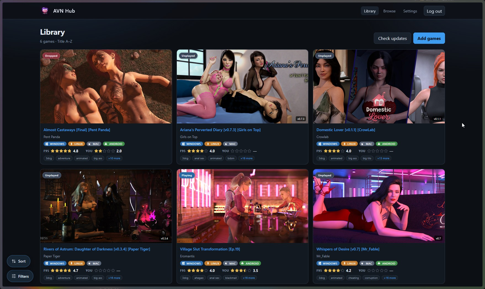
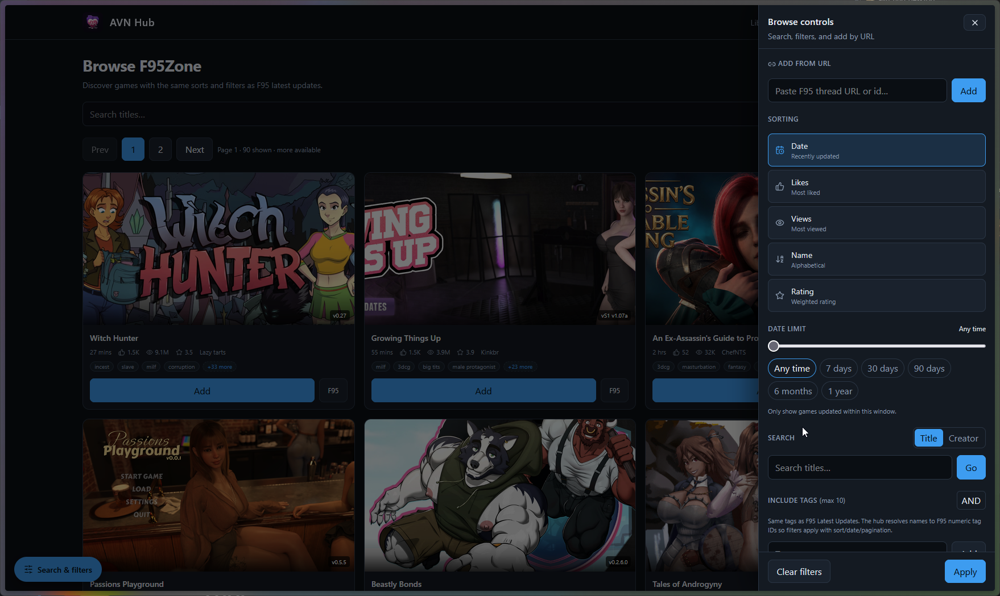
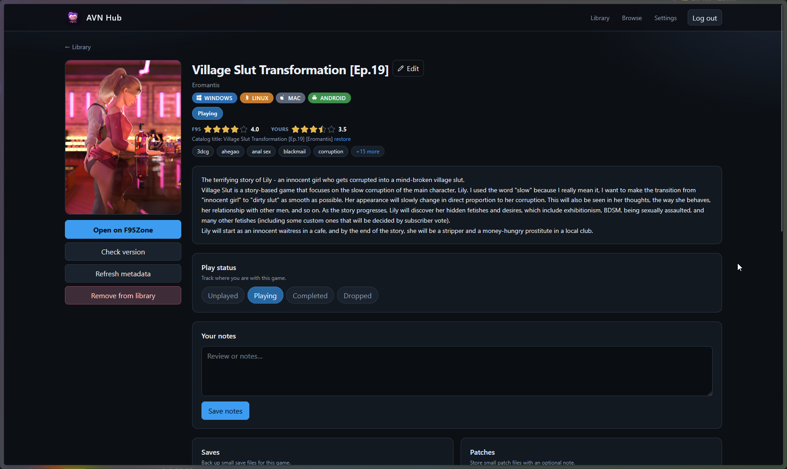
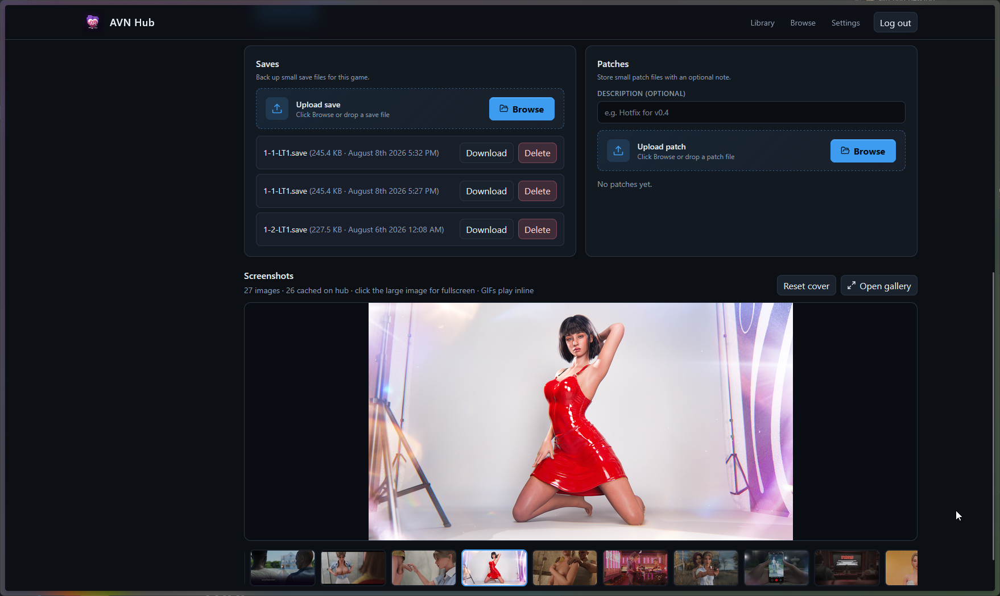
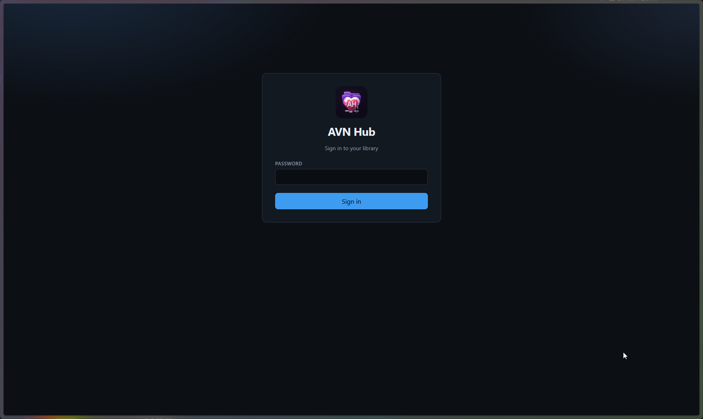

# AVN Hub

Self-hosted library hub for [F95Zone](https://f95zone.to) adult visual novels.

AVN Hub stores your **library metadata** — titles, status, notes, covers, screenshots, update checks, and small **save/patch** backups — on a server you control. It does **not** store game installers. Downloads and installs stay on your PC (for example with [Afterglow](https://github.com/goonedoutgames/afterglow)).

| | |
|---|---|
| **Web UI** | Browse and organize your collection in the browser |
| **API** | Same data for Afterglow and other clients |
| **Host** | Typically Docker on a VPS or home server |

---

## Screenshots











---

## Goals

- Search F95Zone and build a **personal library** you own
- Track **status, ratings, notes, and playtime** (playtime often comes from Afterglow)
- Cache **covers and screenshot galleries** on your hub
- Back up **Ren'Py saves** and small patches across devices
- Stay **self-hosted** — your data directory, your F95 session, your optional API password

---

## Features

- **Browse & search** — F95 catalog with tags, sort, date, and engine filters
- **Library** — add from browse or by thread URL; filter and sort your collection
- **Game details** — description, tags, version, ratings, custom cover, screenshot gallery
- **Tracking** — play status, user rating, notes
- **Update checks** — find newer F95 versions for games you track
- **Media cache** — covers and screenshots under your data directory
- **Saves & patches** — per-game upload/download (not full game archives)
- **F95Zone login** — username/password or cookies (needed for browse, refresh, and links)
- **Optional app password** — lock the web UI and API behind a Bearer token
- **Afterglow-ready** — desktop client connects in **Remote** mode

---

## Get started

### What you need

- A machine that can run **Docker**
- An [F95Zone](https://f95zone.to) account
- A browser — and optionally [Afterglow](https://github.com/goonedoutgames/afterglow) on Windows for downloads, installs, and play

### 1. Run with Docker Compose

```yaml
services:
  avn-hub:
    image: ghcr.io/goonedoutgames/avn-hub:latest
    ports:
      - "8080:8080" # API
      - "8081:8081" # Web UI
    volumes:
      - ./data:/data
    environment:
      AVN_HUB_API_HOST: "0.0.0.0"
      AVN_HUB_API_PORT: "8080"
      AVN_HUB_WEB_HOST: "0.0.0.0"
      AVN_HUB_WEB_PORT: "8081"
      AVN_HUB_DATA_DIR: /data
      AVN_HUB_STATIC_DIR: /app/static
      AVN_HUB_PUBLIC_API_URL: "http://127.0.0.1:8080"
      AVN_HUB_CORS_ORIGINS: "*"
      # Optional first-boot app password:
      # AVN_HUB_BOOTSTRAP_PASSWORD: "changeme"
    restart: unless-stopped
```

```bash
mkdir -p data
docker compose up -d
```

- **Web UI:** http://localhost:8081  
- **API:** http://localhost:8080  
- **Image:** `ghcr.io/goonedoutgames/avn-hub:latest`

### 2. First-time setup

1. Open the web UI (sign in if you set an app password).
2. **Settings** → log into **F95Zone** (or paste cookies).
3. Use **Browse** to find games, or add a thread URL.
4. Optional: connect [Afterglow](https://github.com/goonedoutgames/afterglow) → **Remote** → your API URL (+ password if set).

### 3. Your data

Everything durable lives in `./data` on the host:

| Path | Contents |
|------|----------|
| `data/avn-hub.db` | Library database |
| `data/media/` | Cached covers & screenshots |
| `data/games/{id}/saves/` | Uploaded saves |
| `data/games/{id}/patches/` | Uploaded patches |

Back up this folder if you care about your library.

### Using Afterglow

1. Host AVN Hub (Compose above, or behind your reverse proxy).
2. Install Afterglow and choose **Remote**.
3. Enter the public API base URL (and app password if configured).
4. Ensure F95 is logged in on the hub so Browse and download links work.

Afterglow **Local** mode runs a separate embedded hub on that PC — it does **not** share data with your Docker hub.

---

## Developers & advanced hosting

<details>
<summary><strong>Architecture</strong></summary>

| Piece | Role |
|-------|------|
| `crates/core` | Domain logic, SQLite, F95Zone client |
| `crates/auth` | Single-user password + session tokens |
| `crates/api` | REST API (`/api/v1`) |
| `crates/server` | Dual listeners: API + static web |
| `web/` | React SPA |
| `openapi/openapi.yaml` | OpenAPI 3.1 contract (keep in sync with `crates/api/src/routes.rs`) |

</details>

<details>
<summary><strong>Environment variables</strong></summary>

| Variable | Default | Description |
|----------|---------|-------------|
| `AVN_HUB_API_HOST` / `AVN_HUB_API_PORT` | `0.0.0.0` / `8080` | API bind address (IP/hostname — **not** an `https://` URL) |
| `AVN_HUB_WEB_HOST` / `AVN_HUB_WEB_PORT` | `0.0.0.0` / `8081` | Web bind address |
| `AVN_HUB_DATA_DIR` | `/data` | SQLite + media + saves/patches |
| `AVN_HUB_STATIC_DIR` | `/app/static` | Built SPA assets |
| `AVN_HUB_PUBLIC_API_URL` | `http://127.0.0.1:8080` | Browser-facing API origin in `config.json` |
| `AVN_HUB_CORS_ORIGINS` | `*` | Allowed web UI origins (comma-separated) |
| `AVN_HUB_BOOTSTRAP_PASSWORD` | _(unset)_ | App password on first boot if none exists |
| `AVN_HUB_UID` / `AVN_HUB_GID` | `10001` / `10001` | Ownership applied to `/data` before drop-privileges |

The entrypoint chowns `/data` then runs as `avnhub`. Build locally with `docker compose up -d --build`.

</details>

<details>
<summary><strong>Reverse proxy</strong></summary>

Examples: [`deploy/nginx/`](deploy/nginx/) and [`deploy/docker/compose.swag.example.yml`](deploy/docker/compose.swag.example.yml).

Keep the app on **8080/8081 inside the container**. Point the proxy at those ports, then set:

```yaml
environment:
  AVN_HUB_PUBLIC_API_URL: "https://avns-api.example.com"
  AVN_HUB_CORS_ORIGINS: "https://avns.example.com"
```

`AVN_HUB_*_HOST` is only the bind address. Do not publish `8080`/`8081` publicly when TLS terminates on the proxy.

</details>

<details>
<summary><strong>Local development</strong></summary>

```bash
# API
cargo run -p avn-hub-server

# Web (Vite proxies /api → http://127.0.0.1:8080)
cd web && pnpm install && pnpm dev
```

</details>

<details>
<summary><strong>API</strong></summary>

Contract: [`openapi/openapi.yaml`](openapi/openapi.yaml).

Auth: `Authorization: Bearer <token>` from `POST /api/v1/auth/login`.

Catalog, library, games (refresh, cover, saves, patches), media, and settings live under `/api/v1/...`.

</details>

<details>
<summary><strong>Windows sidecar (Afterglow Local)</strong></summary>

`v*` tags run [`.github/workflows/windows-release.yml`](.github/workflows/windows-release.yml) and attach `avn-hub.exe` / `avn-hub-windows-x64.exe` to the GitHub Release. Manual: **Actions → Windows sidecar release**.

</details>

<details>
<summary><strong>CI notes</strong></summary>

Docker/image workflows skip **docs-only** pushes (Markdown, `media/`, license). Version tags and manual `workflow_dispatch` always build.

</details>

## License

MIT
